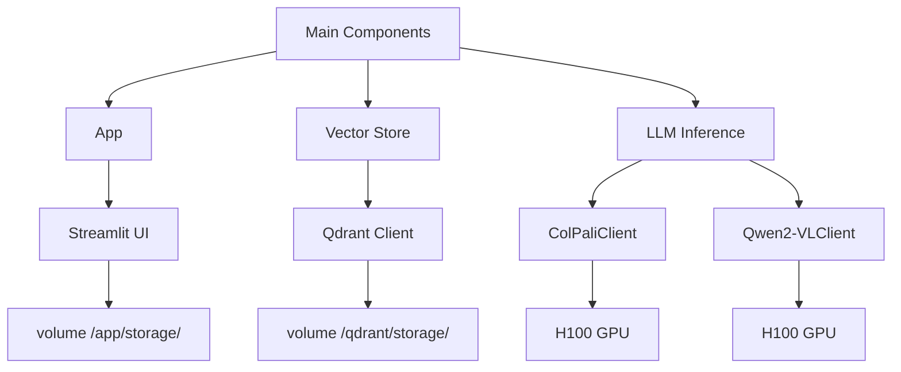
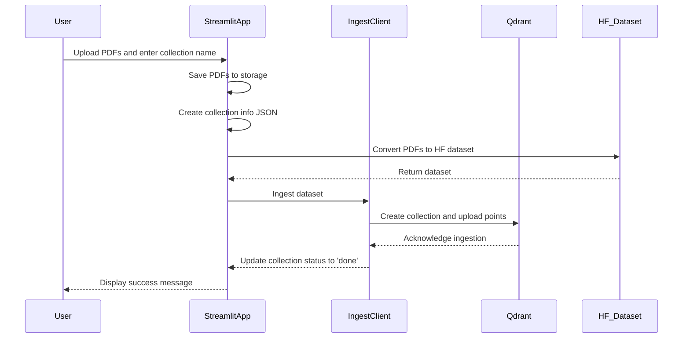
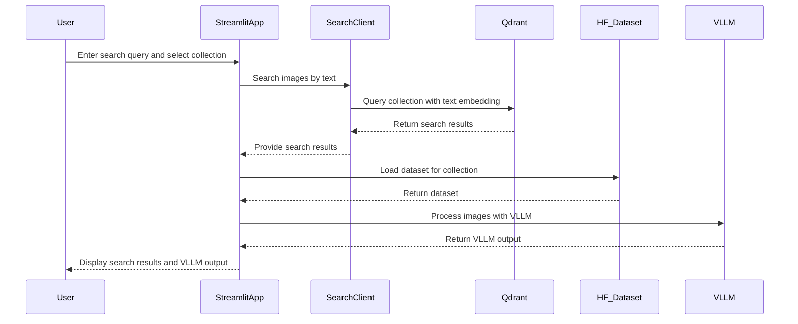

# AI Search Demo 

## Description

This is a small demo showing how to build AI search on top of visual data (PDFs, Images, etc.)

## Why 

The classic way to handle visual documents (PDFs, forms, images, etc.) is to use OCR, Layout Detection, Table Recognition, etc. See [PDF-Extract-Kit](https://github.com/opendatalab/PDF-Extract-Kit) [Tesseract](https://github.com/tesseract-ocr/tesseract) or [PaddleOCR](https://github.com/PaddlePaddle/PaddleOCR) for example. However, we are going to split PDFs by page and embed each as an image to avoid complexity. The main models we are going to use are [Qwen2-VL](https://arxiv.org/abs/2409.12191) for visual understanding and ColPali.


## Evaluation

Before developing this, we want to understand how the system performs in general. For this, we are going to generate synthetic data based on SmartHR data and evaluate it. This is not a real estimate but a starting point to automate some evaluation. In real life, data from actual use should be used for this.


### Metrics: 

- NDCG@1: Measures how relevant the very top result is, adjusting for its position in the ranking.
- NDCG@5: Evaluates the overall relevance and order of the top 5 results in a normalized way.
- Recall@1: Indicates the percentage of all relevant items found when considering only the first result.
- Recall@5: Shows the percentage of all relevant items retrieved within the top 5 results.
- Precision@1: Reflects the proportion of relevant items in the very first result retrieved.
- Precision@5: Represents the proportion of relevant items among the top 5 results returned.

### Datasets:

- [Smart HR Synthetic Data Single Image Single Query](https://huggingface.co/datasets/koml/smart-hr-synthetic-data-single-image-single-query)
- [Smart HR Synthetic Data Single Image Multiple Queries](https://huggingface.co/datasets/koml/smart-hr-synthetic-data-single-image-multiple-queries)

### Results:

| Dataset | Language | NDCG@1 | NDCG@5 | Recall@1 | Recall@5 | Precision@1 | Precision@5 |
|---------|----------|--------|--------|----------|----------|-------------|-------------|
| [synthetic-data-single-image-single-query](https://huggingface.co/datasets/koml/smart-hr-synthetic-data-single-image-single-query) | English  | 0.5190 | 0.7021 | 0.5190   | 0.8354   | 0.5190      | 0.1671      |
| [synthetic-data-single-image-single-query](https://huggingface.co/datasets/koml/smart-hr-synthetic-data-single-image-single-query) | Japanese | 0.7215 | 0.8342 | 0.7215   | 0.9241   | 0.7215      | 0.1848      |
| [smart-hr-synthetic-data-single-image-multiple-queries](https://huggingface.co/datasets/koml/smart-hr-synthetic-data-single-image-multiple-queries) | English  | 0.4937 | 0.5256 | 0.4937   | 0.5443   | 0.4937      | 0.1089      |
| [smart-hr-synthetic-data-single-image-multiple-queries](https://huggingface.co/datasets/koml/smart-hr-synthetic-data-single-image-multiple-queries) | Japanese | 0.6582 | 0.6982 | 0.6582   | 0.7215   | 0.6582      | 0.1443      |


### Process:

The evaluation process consists of two stages: generating synthetic data based on existing SmartHR PDFs and evaluating our visual retrieval. To run a small test:

```
python ai_search_demo/evaluate_synthetic_data.py create-synthetic-dataset ./example_data/smart-hr ./example_data/smart-hr-dataset-test koml/smart-hr-synthetic-data-test
python ai_search_demo/evaluate_synthetic_data.py evaluate-on-synthetic-dataset koml/smart-hr-synthetic-data-test --collection-name small-eval
```

To reproduce the results table:

Smart HR Synthetic Data Single Image Single Query

```
python ai_search_demo/evaluate_synthetic_data.py create-synthetic-dataset ./example_data/smart-hr ./example_data/smart-hr-synthetic-data-single-image-single-query koml/smart-hr-synthetic-data-single-image-single-query --num-samples 79
python ai_search_demo/evaluate_synthetic_data.py evaluate-on-synthetic-dataset koml/smart-hr-synthetic-data-single-image-single-query --collection-name smart-hr-synthetic-data-single-image-single-query
```

Smart HR Synthetic Data Single Image Multiple Queries

```
python ai_search_demo/evaluate_synthetic_data.py create-synthetic-dataset ./example_data/smart-hr ./example_data/smart-hr-synthetic-data-single-image-multiple-queries koml/smart-hr-synthetic-data-single-image-multiple-queries --num-samples 1000
python ai_search_demo/evaluate_synthetic_data.py evaluate-on-synthetic-dataset koml/smart-hr-synthetic-data-single-image-multiple-queries --collection-name smart-hr-synthetic-data-single-image-multiple-queries
```

## Demo data

- [SmartHR](https://smarthr.jp/know-how/ebook/tv-campaign/)
- VC Reports: [InfraRed](https://www.redpoint.com/infrared/report/) & [024: The State of Generative AI in the Enterprise](https://menlovc.com/2024-the-state-of-generative-ai-in-the-enterprise/)

## Architecture 

High-level diagram of the system.





Create new collection



Use AI Search



## Endpoint

- [App](https://smart-hr-workshop.up.railway.app/)
- [Qdrant](https://qdrant.up.railway.app/dashboard)
- [ColPali](https://truskovskiyk--colpali-embedding-serve.modal.run/docs)
- [Qwen2-VL](https://truskovskiyk--qwen2-vllm-serve.modal.run/docs)

## LLM inference 


Setup

```
pip install modal
modal setup
```

Download models

```
modal run llm-inference/llm_serving_load_models.py --model-name Qwen/Qwen2.5-7B-Instruct --model-revision bb46c15ee4bb56c5b63245ef50fd7637234d6f75
modal run llm-inference/llm_serving_load_models.py --model-name Qwen/Qwen2-VL-7B-Instruct --model-revision 51c47430f97dd7c74aa1fa6825e68a813478097f
modal run llm-inference/llm_serving_load_models.py --model-name Qwen/Qwen2-VL-72B-Instruct --model-revision bb46c15ee4bb56c5b63245ef50fd7637234d6f75
modal run llm-inference/llm_serving_load_models.py --model-name vidore/colqwen2-v1.0-merged --model-revision 364a4f5df97231e233e15cbbaf0b9dbe352ba92c
```

Deploy models

```
modal deploy llm-inference/llm_serving.py
modal deploy llm-inference/llm_serving_colpali.py
```