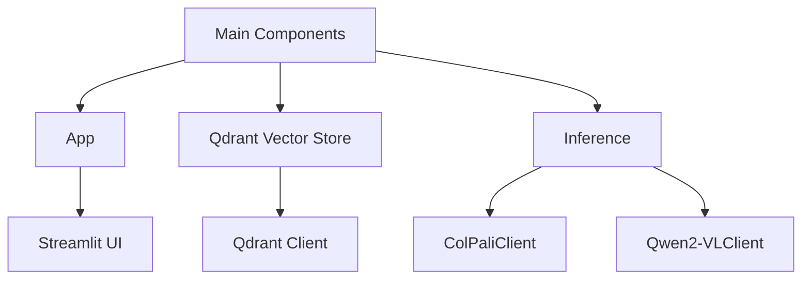

# AI Search Demo 

## Description 

This is a small demo showing how to build AI search on top of visual reach data (PDFs, Images, etc)

## Why 

Classic way to handle visual documents (PDFs, formts, images, etc) to use OCR, Layout Detection, Table Recognition, etc. See [PDF-Extract-Kit](https://github.com/opendatalab/PDF-Extract-Kit) for exaple. But 


## Evaluation

Before developing this we want to understand how the system performs in general, for this we are going to generate synthetic data based on SmartHR data and evaluate. This is not a real estimate, but a starting point to automate some evaluation. In real life - data from actual use should be used for this.


### Metrics: 

- NDCG@1: Measures how relevant the very top result is, adjusting for its position in the ranking.
- NDCG@5: Evaluates the overall relevance and order of the top 5 results in a normalized way.
- Recall@1: Indicates the percentage of all relevant items found when considering only the first result.
- Recall@5: Shows the percentage of all relevant items retrieved within the top 5 results.
- Precision@1: Reflects the proportion of relevant items in the very first result retrieved.
- Precision@5: Represents the proportion of relevant items among the top 5 results returned.

### Datasets:

- [Smart HR Synthetic Data Single Image Single Query](https://huggingface.co/datasets/koml/smart-hr-synthetic-data-single-image-single-query)
- [Smart HR Synthetic Data Single Image Multiple Queries](https://huggingface.co/datasets/koml/smart-hr-synthetic-data-single-image-multiple-queries)

### Results:

| Dataset | Language | NDCG@1 | NDCG@5 | Recall@1 | Recall@5 | Precision@1 | Precision@5 |
|---------|----------|--------|--------|----------|----------|-------------|-------------|
| [synthetic-data-single-image-single-query](https://huggingface.co/datasets/koml/smart-hr-synthetic-data-single-image-single-query) | English  | 0.5190 | 0.7021 | 0.5190   | 0.8354   | 0.5190      | 0.1671      |
| [synthetic-data-single-image-single-query](https://huggingface.co/datasets/koml/smart-hr-synthetic-data-single-image-single-query) | Japanese | 0.7215 | 0.8342 | 0.7215   | 0.9241   | 0.7215      | 0.1848      |

| [smart-hr-synthetic-data-single-image-multiple-queries](https://huggingface.co/datasets/koml/smart-hr-synthetic-data-single-image-multiple-queries) | English  | 0.5190 | 0.7021 | 0.5190   | 0.8354   | 0.5190      | 0.1671      |
| [smart-hr-synthetic-data-single-image-multiple-queries](https://huggingface.co/datasets/koml/smart-hr-synthetic-data-single-image-multiple-queries) | Japanese | 0.7215 | 0.8342 | 0.7215   | 0.9241   | 0.7215      | 0.1848      |


### Process:

The evaluation process had two stages: we generated synthetic data based on existing SmartHR PDFs and evaluated our visual retrieval. To run a small test:

```
python ai_search_demo/evaluate_synthetic_data.py create-synthetic-dataset ./example_data/smart-hr ./example_data/smart-hr-dataset-test koml/smart-hr-synthetic-data-test
python ai_search_demo/evaluate_synthetic_data.py evaluate-on-synthetic-dataset koml/smart-hr-synthetic-data-test --collection-name small-eval
```

To run large evaluation:

```
python ai_search_demo/evaluate_synthetic_data.py create-synthetic-dataset ./example_data/smart-hr ./example_data/smart-hr-synthetic-data-single-image-single-query koml/smart-hr-synthetic-data-single-image-single-query --num-samples 79
python ai_search_demo/evaluate_synthetic_data.py evaluate-on-synthetic-dataset koml/smart-hr-synthetic-data-single-image-single-query --collection-name smart-hr-synthetic-data-single-image-single-query


python ai_search_demo/evaluate_synthetic_data.py create-synthetic-dataset ./example_data/smart-hr ./example_data/smart-hr-synthetic-data-single-image-multiple-queries koml/smart-hr-synthetic-data-single-image-multiple-queries --num-samples 1000
python ai_search_demo/evaluate_synthetic_data.py evaluate-on-synthetic-dataset koml/smart-hr-synthetic-data-single-image-multiple-queries --collection-name smart-hr-synthetic-data-single-image-multiple-queries
```

## Architecture 

High-level diagram of the system





## LLM inference 

Download models

```
modal run llm-inference/llm_serving_load_models.py --model-name Qwen/Qwen2.5-7B-Instruct --model-revision bb46c15ee4bb56c5b63245ef50fd7637234d6f75
modal run llm-inference/llm_serving_load_models.py --model-name Qwen/Qwen2-VL-7B-Instruct --model-revision 51c47430f97dd7c74aa1fa6825e68a813478097f
modal run llm-inference/llm_serving_load_models.py --model-name Qwen/Qwen2-VL-72B-Instruct --model-revision bb46c15ee4bb56c5b63245ef50fd7637234d6f75
modal run llm-inference/llm_serving_load_models.py --model-name vidore/colqwen2-v1.0-merged --model-revision 364a4f5df97231e233e15cbbaf0b9dbe352ba92c
```

Deploy models

```
modal deploy llm-inference/llm_serving.py 
modal deploy llm-inference/llm_serving_colpali.py
```

## DB 

```
docker run -p 6333:6333 -p 6334:6334 -v $(pwd)/qdrant_storage:/qdrant/storage:z qdrant/qdrant
```

## APP 

```
docker build -t smart-hr-ai-search:latest .
docker run -p 8000:8000 -v $(pwd)/app_storage:/storage smart-hr-ai-search:latest
```

## References:

- [ColPali: Efficient Document Retrieval with Vision Language Models](https://github.com/illuin-tech/colpali?)
- [Qdrant - Vector Databas](https://github.com/qdrant/qdrant)