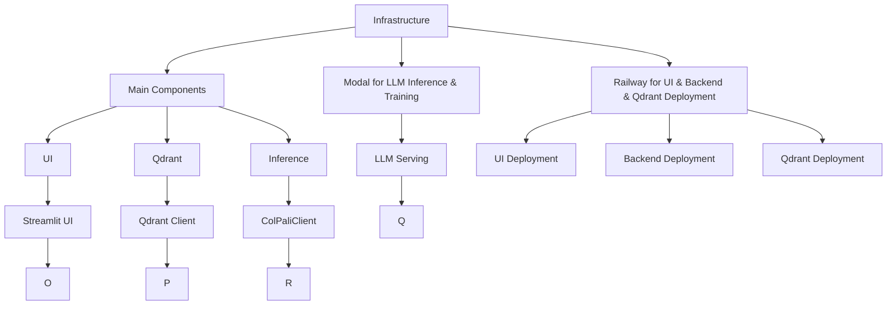

# AI Search Demo 

## Description 

This is a small demo showing how to build AI search on top of visual reach data (PDFs, Images, etc)


## Architecture 

Hitht leve diagram of the systen 





## Evaluation

Before developing this we want to understand how the system performs in general, for this we are going to generate synthetic data based on SmartHR data and evaluate. This is not a real estimate, but a starting point to automate some evaluation. In real life - data from actual use should be used for this.

### Results:

| Dataset | Language | NDCG@1 | NDCG@3 | Recall@1 | Recall@3 | Precision@1 | Precision@4 |
|---------|----------|--------|--------|----------|----------|-------------|-------------|
| [synthetic-data-single-image-single-query](https://huggingface.co/datasets/koml/smart-hr-synthetic-data-single-image-single-query) | English  | 0.85   | 0.78   | 0.90     | 0.82     | 0.88        | 0.75        |
| [synthetic-data-single-image-single-query](https://huggingface.co/datasets/koml/smart-hr-synthetic-data-single-image-single-query) | Japanese | 0.80   | 0.76   | 0.85     | 0.80     | 0.83        | 0.70        |
| [Dataset 3](#) | English  | 0.82   | 0.79   | 0.87     | 0.81     | 0.85        | 0.72        |
| [Dataset 4](#) | Japanese | 0.78   | 0.74   | 0.82     | 0.78     | 0.80        | 0.68        |


### Process:

Evaluation process had 2 stage: we generate sytbeht data based on existng SmartHR PDFs and evaluate our visual retravala. To run small test:

```
python ai_search_demo/evaluate_synthetic_data.py create-synthetic-dataset ./example_data/smart-hr ./example_data/smart-hr-dataset-test koml/smart-hr-synthetic-data-test
python ai_search_demo/evaluate_synthetic_data.py evaluate-on-synthetic-dataset koml/smart-hr-synthetic-data-test --collection-name small-eval
```

To run large evaluation:

```
python ai_search_demo/evaluate_synthetic_data.py create-synthetic-dataset ./example_data/smart-hr ./example_data/smart-hr-synthetic-data-single-image-single-query koml/smart-hr-synthetic-data-single-image-single-query --num-samples 79
python ai_search_demo/evaluate_synthetic_data.py evaluate-on-synthetic-dataset koml/smart-hr-synthetic-data-single-image-single-query --collection-name smart-hr-synthetic-data-single-image-single-query


python ai_search_demo/evaluate_synthetic_data.py create-synthetic-dataset ./example_data/smart-hr ./example_data/smart-hr-synthetic-data-single-image-multiple-queries koml/smart-hr-synthetic-data-single-image-multiple-queries --num-samples 1000
```


## LLM inference 

Download models

```
modal run llm-inference/llm_serving_load_models.py --model-name Qwen/Qwen2.5-7B-Instruct --model-revision bb46c15ee4bb56c5b63245ef50fd7637234d6f75
modal run llm-inference/llm_serving_load_models.py --model-name Qwen/Qwen2-VL-7B-Instruct --model-revision 51c47430f97dd7c74aa1fa6825e68a813478097f
modal run llm-inference/llm_serving_load_models.py --model-name Qwen/Qwen2-VL-72B-Instruct --model-revision bb46c15ee4bb56c5b63245ef50fd7637234d6f75
modal run llm-inference/llm_serving_load_models.py --model-name vidore/colqwen2-v1.0-merged --model-revision 364a4f5df97231e233e15cbbaf0b9dbe352ba92c
```

Deploy models

```
modal deploy llm-inference/llm_serving.py 
modal deploy llm-inference/llm_serving_colpali.py
```

## DB 

```
docker run -p 6333:6333 -p 6334:6334 -v $(pwd)/qdrant_storage:/qdrant/storage:z qdrant/qdrant
```

## APP 

```
docker build -t smart-hr-ai-search:latest .
docker run -p 8000:8000 -v $(pwd)/app_storage:/storage smart-hr-ai-search:latest
```

## References:

- [ColPali: Efficient Document Retrieval with Vision Language Models](https://github.com/illuin-tech/colpali?)
- [Qdrant - Vector Databas](https://github.com/qdrant/qdrant)