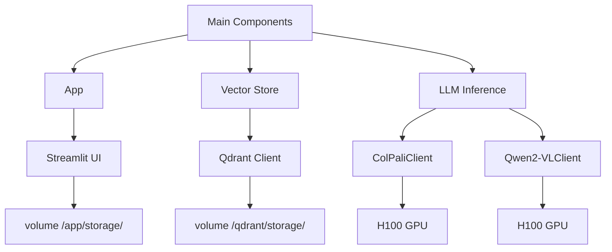
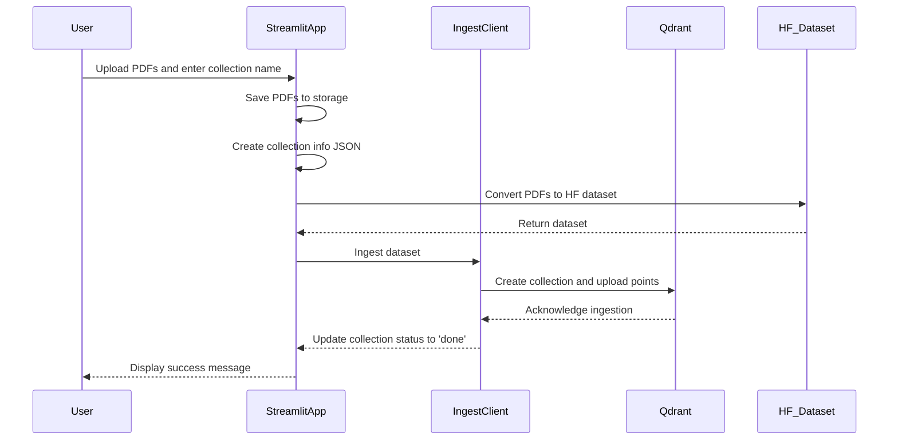
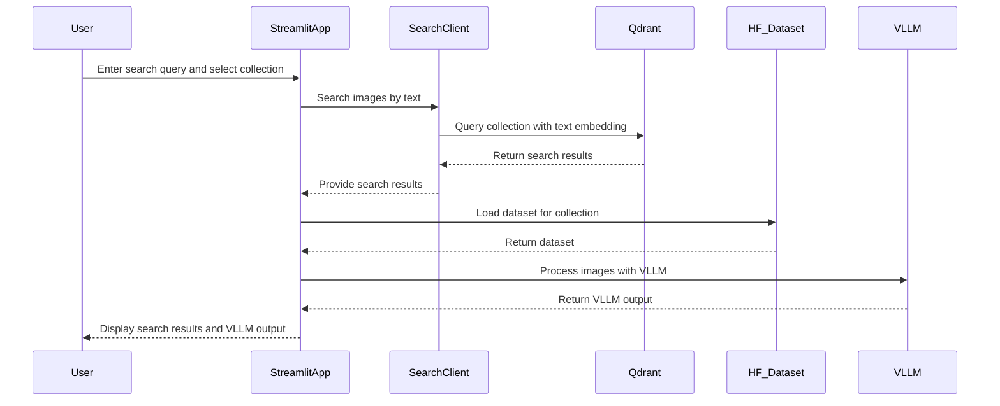

# AI検索デモ

## 説明

これは、視覚データ（PDF、画像など）を基にAI検索を構築する方法を示す小さなデモです。

## なぜ

視覚的な文書（PDF、フォーム、画像など）を扱う従来の方法は、OCR、レイアウト検出、テーブル認識などを使用することです。例えば、[PDF-Extract-Kit](https://github.com/opendatalab/PDF-Extract-Kit)、[Tesseract](https://github.com/tesseract-ocr/tesseract)、または[PaddleOCR](https://github.com/PaddlePaddle/PaddleOCR)を参照してください。しかし、私たちはPDFをページごとに分割し、各ページを画像として埋め込むことで複雑さを回避します。視覚的理解のために使用する主なモデルは[Qwen2-VL](https://arxiv.org/abs/2409.12191)とColPaliです。

## 評価

これを開発する前に、システムが全体的にどのように機能するかを理解したいと考えています。そのために、SmartHRデータに基づいて合成データを生成し、それを評価します。これは実際の見積もりではなく、評価を自動化するための出発点です。実際には、実際の使用からのデータを使用する必要があります。


### メトリクス:

- NDCG@1: ランキング内の位置に応じて、最上位の結果がどれほど関連性があるかを測定します。
- NDCG@5: 上位5件の結果の全体的な関連性と順序を正規化された方法で評価します。
- Recall@1: 最初の結果のみを考慮した場合に見つかったすべての関連項目の割合を示します。
- Recall@5: 上位5件の結果内で取得されたすべての関連項目の割合を示します。
- Precision@1: 取得された最初の結果における関連項目の割合を反映します。
- Precision@5: 返された上位5件の結果の中で関連項目の割合を表します。

### データセット:

- [Smart HR Synthetic Data Single Image Single Query](https://huggingface.co/datasets/koml/smart-hr-synthetic-data-single-image-single-query)
- [Smart HR Synthetic Data Single Image Multiple Queries](https://huggingface.co/datasets/koml/smart-hr-synthetic-data-single-image-multiple-queries)

### 結果:

| データセット | 言語 | NDCG@1 | NDCG@5 | Recall@1 | Recall@5 | Precision@1 | Precision@5 |
|-------------|------|--------|--------|----------|----------|-------------|-------------|
| [synthetic-data-single-image-single-query](https://huggingface.co/datasets/koml/smart-hr-synthetic-data-single-image-single-query) | 英語  | 0.5190 | 0.7021 | 0.5190   | 0.8354   | 0.5190      | 0.1671      |
| [synthetic-data-single-image-single-query](https://huggingface.co/datasets/koml/smart-hr-synthetic-data-single-image-single-query) | 日本語 | 0.7215 | 0.8342 | 0.7215   | 0.9241   | 0.7215      | 0.1848      |
| [smart-hr-synthetic-data-single-image-multiple-queries](https://huggingface.co/datasets/koml/smart-hr-synthetic-data-single-image-multiple-queries) | 英語  | 0.4937 | 0.5256 | 0.4937   | 0.5443   | 0.4937      | 0.1089      |
| [smart-hr-synthetic-data-single-image-multiple-queries](https://huggingface.co/datasets/koml/smart-hr-synthetic-data-single-image-multiple-queries) | 日本語 | 0.6582 | 0.6982 | 0.6582   | 0.7215   | 0.6582      | 0.1443      |


### プロセス:

評価プロセスは、既存のSmartHR PDFに基づいて合成データを生成し、視覚的な検索を評価する2つの段階で構成されています。小さなテストを実行するには：

```
python ai_search_demo/evaluate_synthetic_data.py create-synthetic-dataset ./example_data/smart-hr ./example_data/smart-hr-dataset-test koml/smart-hr-synthetic-data-test
python ai_search_demo/evaluate_synthetic_data.py evaluate-on-synthetic-dataset koml/smart-hr-synthetic-data-test --collection-name small-eval
```

結果表を再現するには：

Smart HR 合成データ 単一画像 単一クエリ

```
python ai_search_demo/evaluate_synthetic_data.py create-synthetic-dataset ./example_data/smart-hr ./example_data/smart-hr-synthetic-data-single-image-single-query koml/smart-hr-synthetic-data-single-image-single-query --num-samples 79
python ai_search_demo/evaluate_synthetic_data.py evaluate-on-synthetic-dataset koml/smart-hr-synthetic-data-single-image-single-query --collection-name smart-hr-synthetic-data-single-image-single-query
```

Smart HR 合成データ 単一画像 複数クエリ

```
python ai_search_demo/evaluate_synthetic_data.py create-synthetic-dataset ./example_data/smart-hr ./example_data/smart-hr-synthetic-data-single-image-multiple-queries koml/smart-hr-synthetic-data-single-image-multiple-queries --num-samples 1000
python ai_search_demo/evaluate_synthetic_data.py evaluate-on-synthetic-dataset koml/smart-hr-synthetic-data-single-image-multiple-queries --collection-name smart-hr-synthetic-data-single-image-multiple-queries
```

## Architecture 

システムの高レベル図。





新しいコレクションを作成



AI検索を使用する



## エンドポイント

- [App](https://smart-hr-workshop.up.railway.app/)
- [Qdrant](https://qdrant.up.railway.app/dashboard)
- [ColPali](https://truskovskiyk--colpali-embedding-serve.modal.run/docs)
- [Qwen2-VL](https://truskovskiyk--qwen2-vllm-serve.modal.run/docs)

## LLM推論

セットアップ

```
pip install modal
modal setup
```


モデルのダウンロード

```
modal run llm-inference/llm_serving_load_models.py --model-name Qwen/Qwen2.5-7B-Instruct --model-revision bb46c15ee4bb56c5b63245ef50fd7637234d6f75
modal run llm-inference/llm_serving_load_models.py --model-name Qwen/Qwen2-VL-7B-Instruct --model-revision 51c47430f97dd7c74aa1fa6825e68a813478097f
modal run llm-inference/llm_serving_load_models.py --model-name Qwen/Qwen2-VL-72B-Instruct --model-revision bb46c15ee4bb56c5b63245ef50fd7637234d6f75
modal run llm-inference/llm_serving_load_models.py --model-name vidore/colqwen2-v1.0-merged --model-revision 364a4f5df97231e233e15cbbaf0b9dbe352ba92c
```

モデルをデプロイする

```
modal deploy llm-inference/llm_serving.py
modal deploy llm-inference/llm_serving_colpali.py
```